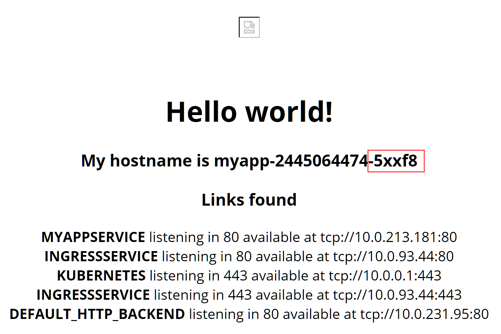
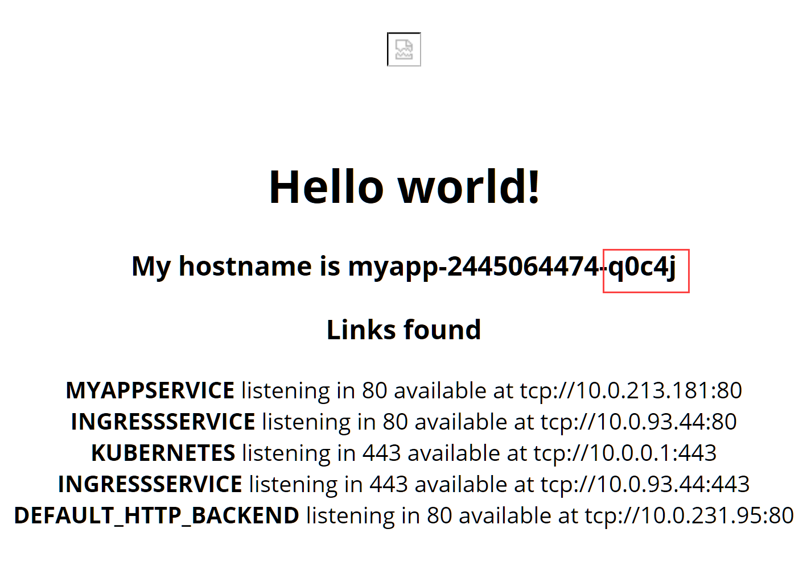
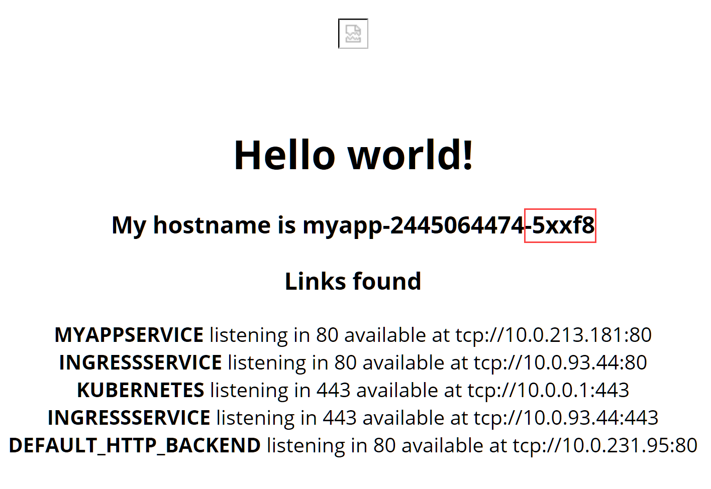

# 1. Create a cluster
To get started you will need to setup a Kubernetes cluster. In this example we will use Azure Container Service (ACS).

Open a command prompt and run:
```
az login
```

Next run:
```
az account list
```

Make sure you select the right Azure subscription, you can change it by running:
```
az account set --subscription <subscription-id>
```

Once you have selected the right subscribtion run the command below to create a new resoucre group for our cluster:
```
az group create --name "introduction-to-k8s" --location "westeurope"
```

Next run the following commadn to create a k8s cluster in Azure Container Service (ACS):
```
az acs create --orchestrator-type kubernetes --name k8scluster --resource-group introduction-to-k8s --agent-count 3 --generate-ssh-keys
```

It will take a few minutes for this command to complete because it has to setup an entire cluster for you. Once it is done you will have a Kubernetes cluster named **k8scluster** (*--name k8scluster*) inside a resource group named **introduction-to-k8s** (*--resource-group introduction-to-k8s*) with 1 master and **3 nodes** (*--agent-count 3*). The **SSH keys required to connect to the cluster** have been generated automatically (*--generate-ssh-keys*).

Next we will download an install kubectl. First check if you don't have it already by running:
```
kubectl
```

If ```kubectl``` is not found, run:
```
az acs kubernetes install-cli
```

Next we need connect to the cluster by running:
```
az acs kubernetes get-credentials --name k8scluster --resource-group introduction-to-k8s
```

Lastly verify we have a connection by running:
```
kubectl get nodes
```
We will ```kubectl``` to further interact with our Kubernetes cluster. But there is also a Web UI or dashboard available. To be able to view this dashboard we need to run ```kubectl proxy``` which will block ```kubectl``` from accepting any further command while making our cluster available on ```localhost``` and proxying requests into our cluster. For conveince open a second command prompt and run the following commands to open the proxy while still being able to run ```kubectl``` commands from your current command prompt:
1. ```az login```
2. ```az account list```
3. ```az account set --subscription <subscription-id>```
4. ```az acs kubernetes get-credentials --name k8scluster --resource-group introduction-to-k8s```
5. ```kubectl proxy```

You can now navigate to [your dashboard](http://localhost:8001/api/v1/proxy/namespaces/kube-system/services/kubernetes-dashboard/#!/cluster?namespace=default). Explore your cluster by clicking on the different links on the left sides such as node, pods, ingress. You can use this dashboard throughout this walkthrough to see what the commands you run change in your cluster.

# 2. Setup ingress routing
First we will have to deploy an ingress controller. There are different ingress controllers available but we will use the [NGINX ingress controller](https://github.com/kubernetes/ingress-nginx) which uses NGINX as a reverse proxy to route traffic to the right services. 

Run the command below to create the default backend used by the ingress controller. All routes that cannot be resolved will be rerouted to this backend which will show a 404 page. First deploy a pod:
```
kubectl apply -f .\files\ingress-default-backend.deployment.yml
```

Next deploy the service so the ingress controller pods can find it:
```
kubectl apply -f .\files\ingress-default-backend.service.yml
```

Run the command below to deploy 2 replicas of the readily available NGINX ingress controller image in our cluster.
```
kubectl apply -f .\files\ingress-controller.deployment.yml
```

Then the command below to deploy the service required for our ingress controller. This service is of the type LoadBalancer and will have a public IP.
```
kubectl apply -f .\files\ingress-controller.service.yml
```

# 3. Deploy "myapp"
Next we will have to deploy our app to our cluster. We will use the [tutum/hello-world](https://hub.docker.com/r/tutum/hello-world/) image for this. This is a readily available image that serves a web page on port 80 that shows the hostname of the pod.  

Run the command below to deploy 3 replicas of "myapp" into our cluster.
```
kubectl apply -f .\files\myapp.deployment.yml
```

Next run the command below to deploy the "myappservice". This service is of the type NodePort and will not have a public IP.
```
kubectl apply -f .\files\myapp.service.yml
```

To make the "myappservice" reachable from outside our cluster we will deploy an Ingress resource for it. This Ingress will tell our Ingress controller how to route traffic from to one of the 3 replicas. Run the command below to deploy it. 
```
kubectl apply -f .\files\myapp.ingress.yml
```

The Ingress controller will automatically detect a change in the Ingress resources of our cluster and generate the required NGINX proxy configuration to route traffic to one of our myapp pods when someone connects to our cluster using ```http://<EXTERNAL-IP>/myapp```

To connect we need to know what the external IP of the ingress ```service```. You can find this by running the following command:
```
kubectl get service
```

The result should be like this:


Navigate to ```http://<EXTERNAL-IP>/myapp``` and you should see something like this:


Refresh the page and you should see something like this:


Refresh the page again and you should see something like this:


Note that you end up on a different instance each time you refresh. This is because the ```myappservice``` loadbalances the requests to the ```myapp``` pods. By default a ```service``` in kubernetes will load balance using round robin. There are 3 instances of the pod so everytime you refresh you will get the next available instance in the queue.

# 4. Simulate node failure
Next we are going to simulate that one of our nodes failes, we will see that Kubernetes will make sure that the desired state (3 replicas of the myapp pod) is satisfied as long as resources are available on the remaining nodes.

First get a list of available nodes by running:
```
kubectl get node
```

You should see something like this 

Next we need to know on which node our pods are running. You can see this by running:
```
kubectl get pod -o wide
```

You should see something like this: 

In our case 2 replicas are running on ```k8s-agent-9b0ce916-2``` so we are going to kill that node by running:
```
 az vm deallocate --resource-group introduction-to-k8s --name k8s-agent-9b0ce916-2 --no-wait
```
Now run the following command and wait until you see the pods have moved to a new node. It might take a few minutes for the vm to shutdown.
```
kubectl get pod -o wide -w
```
After a while you should see something like this:


As you can see in this example the 2 pods that ran on ```k8s-agent-9b0ce916-2``` have been moved to ```k8s-agent-9b0ce916-1```.

You can also run the command below in a seperate command prompt to see when the node goes down:
```
kubectl get node -w
```

Navigate to ```http://<EXTERNAL-IP>/myapp``` again and you should see something like this:


If you refresh the page a few times you should see the ```myappservice``` cycle through all 3 instances of the myapp pod.